# Portfolio Project ERD & Data Model Analysis

이 프로젝트는 전통적인 RDBMS 대신 **Notion API를 Headless CMS처럼 활용**하여 데이터를 관리하고 있습니다. `src/features/common/lib/notion.ts` 및 모델 타입(`Project`, `ParsedResume`)을 바탕으로 역설계한 데이터 구조와 관계(Entity-Relationship)를 도식화했습니다.

## 1. Entity-Relationship Diagram (ERD)

```mermaid
erDiagram
    %% Project (Portfolio Items) Entities
    PROJECT ||--|| PROJECT_OVERVIEW : "1:1 구성"
    PROJECT ||--o{ PROJECT_SKILL : "1:N 사용 기술"
    PROJECT ||--o{ PROJECT_FEATURE : "1:N 주요 기능"
    PROJECT ||--o{ PROJECT_TROUBLESHOOTING : "1:N 문제 해결"

    PROJECT {
        string id PK "Notion Slug / ID"
        string pageId "Notion Page ID"
        string title "프로젝트명"
        string description "한 줄 소개"
        string tags "기술 스택 및 태그 (문자열 배열)"
        string thumbnailUrl "썸네일 이미지 URL"
        string githubUrl "GitHub 링크"
        string demoUrl "데모 링크"
        string figmaUrl "Figma 기획 링크"
        string award "수상 내역"
    }

    PROJECT_OVERVIEW {
        string goal "프로젝트 목표"
        string background "기획 배경"
        string role "담당 역할"
        string period "진행 기간"
        string members "참여 인원"
    }

    PROJECT_SKILL {
        string name "기술명"
        string reason "도입 이유 / 사용 목적"
    }

    PROJECT_FEATURE {
        string title "기능명"
        string description "기능 상세 설명"
        string imageUrl "UI/기능 캡처 이미지"
    }

    PROJECT_TROUBLESHOOTING {
        string problem "발생한 문제 (Symptom)"
        string solution "원인 분석 및 해결 (Cause & Solution)"
        string result "개선 결과 (Impact)"
    }

    %% Resume (이력서/자기소개서) Entities
    RESUME ||--o{ EDUCATION : "학력"
    RESUME ||--o{ EXPERIENCE : "대외활동/경험"
    RESUME ||--o{ WORK_EXPERIENCE : "경력"
    RESUME ||--o{ AWARD : "수상"
    RESUME ||--o{ CERTIFICATE : "자격증"
    RESUME ||--o{ RESUME_SKILL : "보유 기술"

    RESUME {
        string id PK "Notion Resume Page ID"
        string profileImageUrl "프로필 이미지 URL"
    }

    EDUCATION {
        string school "학교/기관명"
        string period "재학 기간"
        json desc "상세 내용 (들여쓰기 배열)"
    }

    EXPERIENCE {
        string category "활동 분류"
        string title "활동명"
        string period "활동 기간"
        json desc "상세 내용 (들여쓰기 배열)"
    }

    WORK_EXPERIENCE {
        string category "경력 (고정)"
        string title "회사 및 직무명"
        string period "재직 기간"
        json desc "상세 내용 (업무 및 성과)"
    }

    AWARD {
        string title "수상 내역"
        string date "수상 일자"
        string org "수여 기관"
    }

    CERTIFICATE {
        string title "자격증명"
        string date "취득 일자"
        string org "발급 기관"
    }

    RESUME_SKILL {
        string category "기술 분야 (Frontend, Backend 등)"
        string skills "기술 스택 목록 (문자열 배열)"
    }
```

## 2. 주요 데이터 도메인 설명

현재 프로젝트의 데이터는 크게 **두 가지 메인 도메인**으로 나뉘며, 백엔드 DB 대신 노션(Notion) 문서를 데이터베이스 삼아 동적으로 파싱하고 있습니다.

### A. 프로젝트 도메인 (Projects / Portfolio)
- **데이터 소스**: Notion Database
- **구조**: DB의 각 Row가 하나의 `PROJECT` 엔티티가 되며, 컬럼(Property) 데이터를 통해 메인 정보를 가져옵니다.
- **특징**: 
  - 썸네일, 주요 링크(GitHub, Demo), 설명, 기술 태그 등이 객체화됩니다.
  - 하위에 속하는 `OVERVIEW`, `SKILL`, `FEATURE`, `TROUBLESHOOTING` 모델은 프로젝트의 상세 명세서 역할을 합니다. 참고하신 `TROUBLESHOOTING.md`의 내용(3D 최적화, RAG 모델링 안정화, API Rate Limit 해결 등)은 각 프로젝트의 `PROJECT_TROUBLESHOOTING` 엔티티 안으로 구조화되어 화면에 매핑되는 형태를 띕니다.

### B. 이력서 도메인 (Resume)
- **데이터 소스**: Notion Page (`process.env.NOTION_PORTFOLIO_PAGE_ID`에 지정된 단일 문서)
- **구조**: 단일 노션 페이지 내부의 블록(통 텍스트, 리스트 등)들을 재귀적으로 순회 및 파싱(Parsing)하여 이력서 형태의 JSON 트리로 구축합니다.
- **특징**:
  - `Heading 1, 2, 3` 블록을 스캔해 `Education`, `Experience`, `WorkExperience`, `Awards`, `Certificates`, `Skills` 등의 데이터 섹션을 동적으로 분류합니다.
  - Bulleted List 하위에 있는 자식 블록(Children)을 `depth` 단위로 묶어(`desc`), 복잡하고 계층적인 이력 내용도 빠짐없이 랜더링할 수 있도록 설계되어 있습니다.